Op PCBs wordt meestal een 4de golf antenne gebruikt, belangrijk hierbij zijn:
* de antenne lengte
* de antenne voeding
* vorm en grootte van het grondvlak en retourpad (hoe groter oppervlak, hoe lager de resonatiefrequentie)
* als de antenne in een plastieken omhulsel geplaatst wordt, dan verlaagd ook de resonatiefrequentie.

De meeste Gateways staan in centrum brugge. Er staat ook 1 op het zwin.
Als er een node in zeebrugge geplaatst wordt, dan is de dichste de gateway aan het zwin (5km)
De antenne van de node moet dus 5 km kunnen overbruggen.

# gevonden ontwerpen:

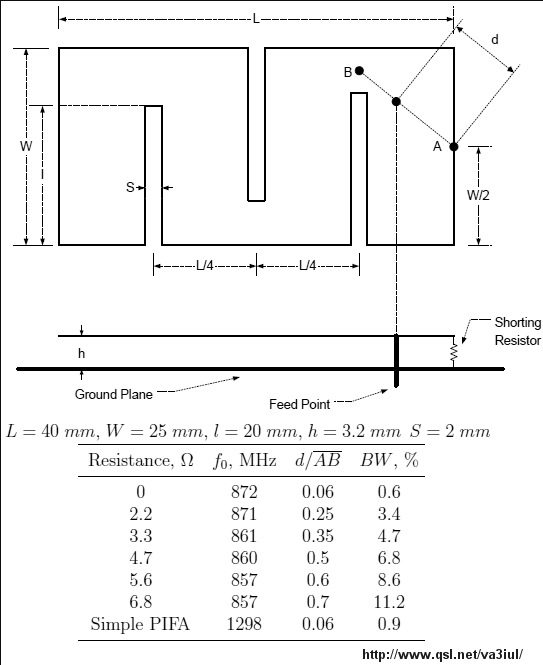
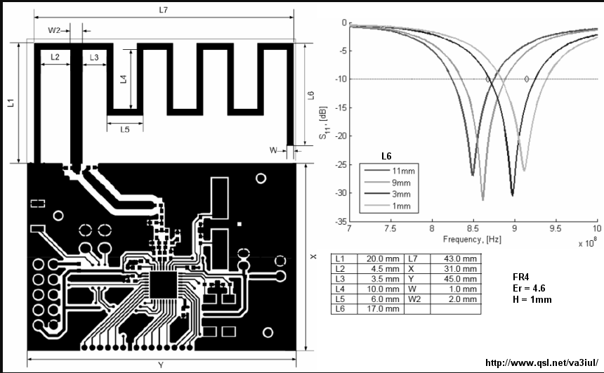
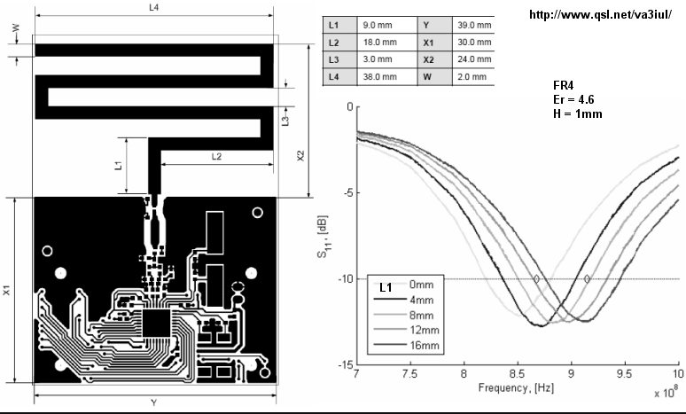

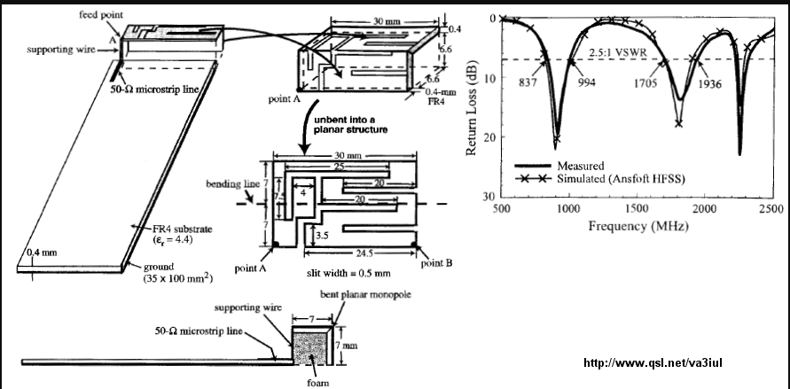

overzicht van verschillende antennes van ti:
http://www.ti.com/lit/an/swra351a/swra351a.pdf

https://www.ti.com/lit/an/swra227e/swra227e.pdf 

http://www.ti.com/lit/an/swra416/swra416.pdf

http://www.ti.com/lit/an/swra228c/swra228c.pdf

https://www.cypress.com/file/136236/download

https://eth0maz.wordpress.com/2016/12/05/lorawan-node-with-onboard-antenna/

Het grootte nadeel aan een PCB antenne is dat het bereik ervan beperkt is. Als er een node wordt opgesteld in zeebrugge moet er zeker 5km overbrugt worden met de antenne. Met een PCB-antenne is dit bijna onmoggelijk.
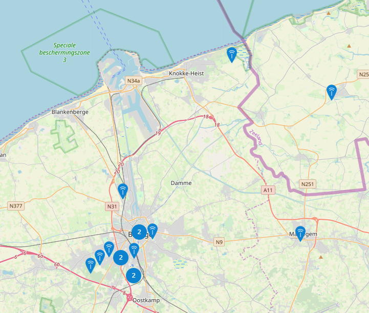

verschillende soorten PCB antennes:

LOOP
* hoe groter de loop, hoe beter het werkt
* alle omtrekken kleiner dan 0.1 golflengte zijn nutteloos. Voor 868MHz is de golflente 0.35m = 35cm (redelijk groot)
* zeer onefficiënt

PATCH
* breedte van een het vierkant is dicht bij ((golflengte/2)/vierkantswortel van dielectric constant). de breedte zal dus rond de 9cm liggen.
* bandbreedte is zeer smal

INVERTED-F
* groot ground plane nodig

MEANDER LINE
* kleiner bereik

file:///C:/Users/laura/Downloads/Antenna_Reference_Design_Guide_ISM.pdf

Het probleem bij PCB antennes is dat je een richtingseffect krijgt, dat de antenne niet in alle richtingen even goed zal kunnen ontvangen.

PCB antenne: (straalt niet in alle richtingen even veel uit, heeft een richtingseffect)

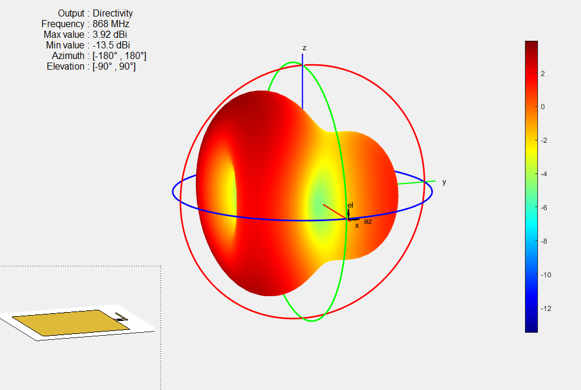

# dipool: (straalt mooi in alle richtingen evenveel uit)

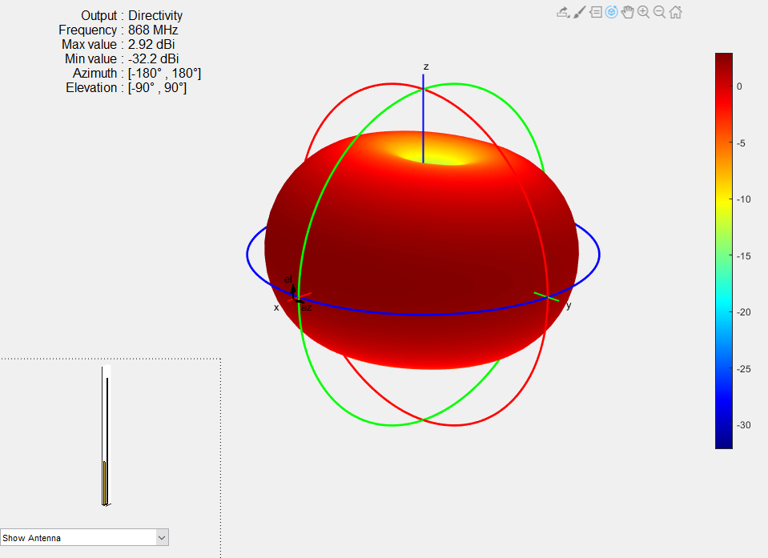

# biquad antenne: 
stralingspatroon is beter dan van de eerste pcb antenne, dit is niet echt een pcb antenne

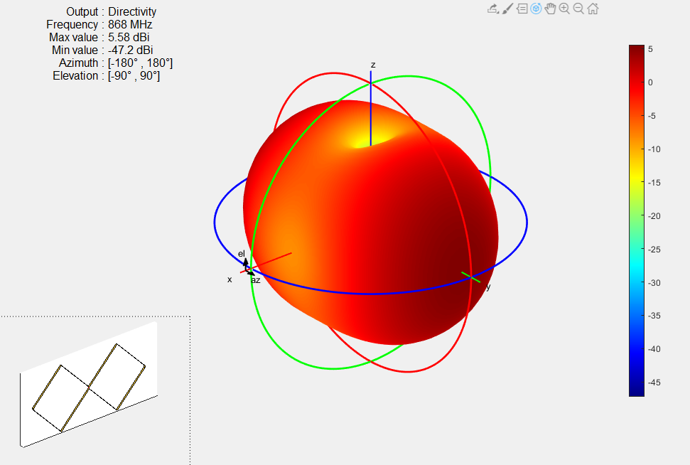

op thingiverse staat er een ontwerp dat je kan printen, en dan zelf er een draad in de gleuven legt, maar de afmetingen zijn ook te groot.(https://www.thingiverse.com/thing:2221922 )

# gasket antenne

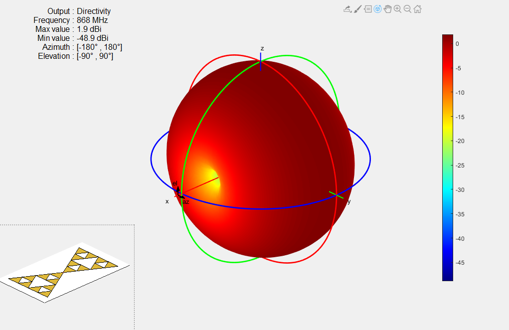
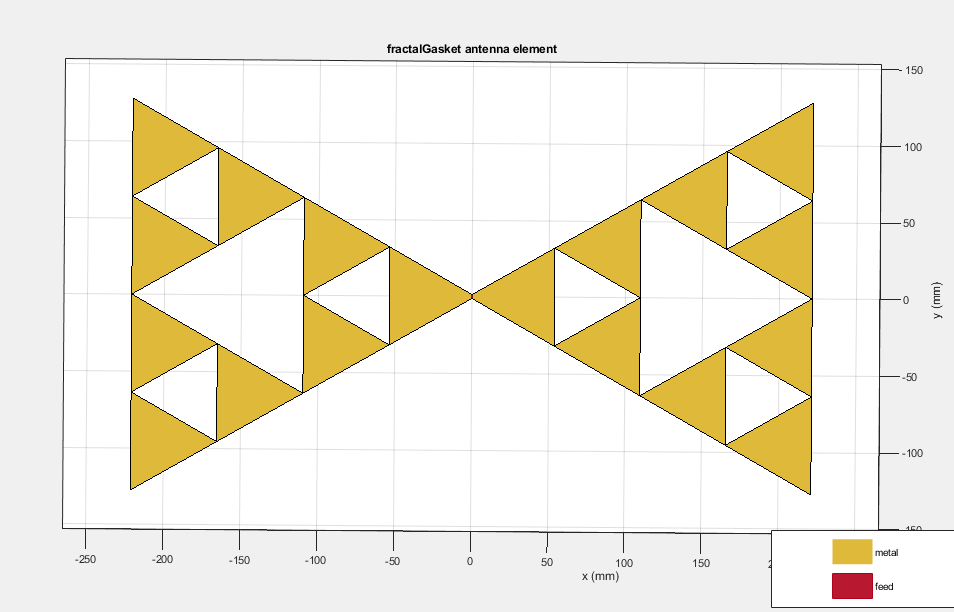

voordeel: heeft de beste stralingspatroon, van alle platte antennen.

nadeel: moeilijker te tekenen

nadeel:de afmetingen van de antenne zijn te groot, om in de behuizing te plaatsen

-> niet bruikbaar voor onze opstelling.

# koch antenna
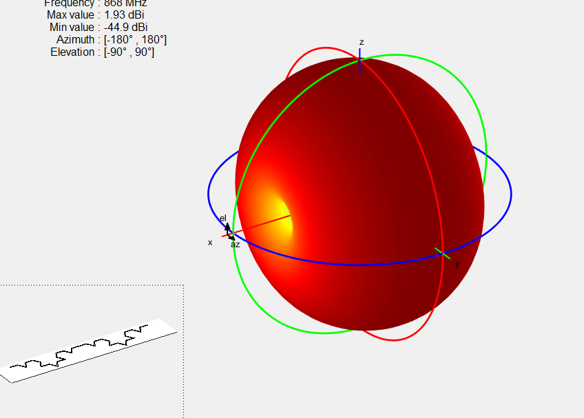

# inverted F
* terug te groot voor onze opstelling (20cm breedte, volgens mathlab)

# commercieel
https://www.amazon.co.uk/Lillyelectronics-Q-BAIHE-865-868MHz-Antenna-Connector/dp/B017N761JQ 

# met mahtlab
https://nl.mathworks.com/products/antenna.html

# vereisten
* De radiaton van de antenne moet Omnidirectional zijn, dit wil zeggen dat de antenne in alle richtingen even veel uitzendt/ontvangt. Dit is nodig in ons geval, omdat de gateway overal kan staan.
* De polarizatie van de antenne van de node wordt best verticaal genomen. Dit omdat de meeste gateways ook verticaal werken.
* De bandbreedte, Als de bandbreedte zeer smal is dan is deze zeer moeilijk te maken, maar heb je wel een optimaal ontvangst.
* hoge efficienty, bij een hoge efficienty zijn er niet veel verliezen in de antenne.

file:///C:/Users/laura/Downloads/HF-Praxis7-2015%20V.pdf

http://www.ti.com/lit/an/swra227e/swra227e.pdf

# antenne die zal worden gemaakt worden

http://www.ti.com/lit/an/swra228c/swra228c.pdf
https://github.com/cernohorsky/LoRa-Node

Op deze ontwerpen zal ik mij baseren bij het tekenen en onwerpen van de PCB antenne.

Deze antenne is niet omnidirectioneel, waardoor je een richtingsantenne krijgt. Het is namelijk bijna onmogelijk om een pcb antenne te vinden/ontwikkelen die omnidirectioneel is en nog in de doos zou kunnen.
De afmetingen van deze antenne zijn wel klein genoeg om in de doos te kunnen plaatsen, vandaar de keuze.

