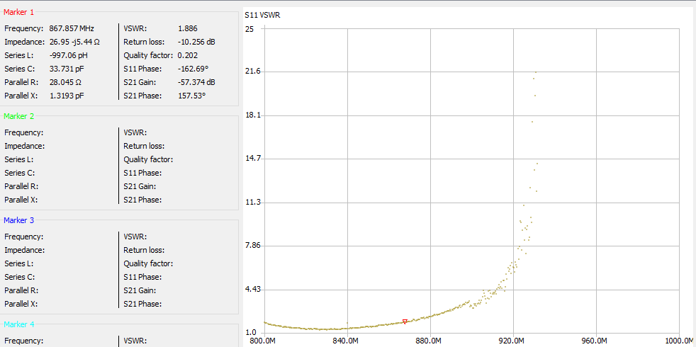
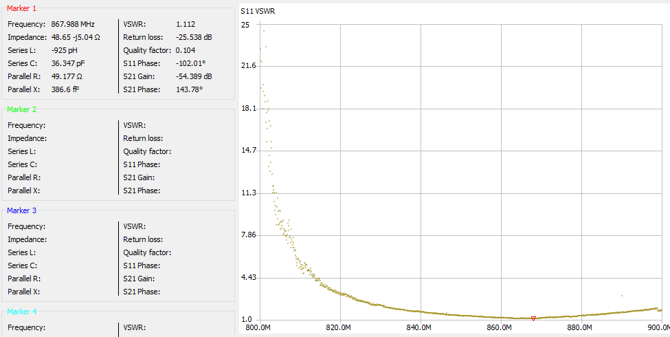
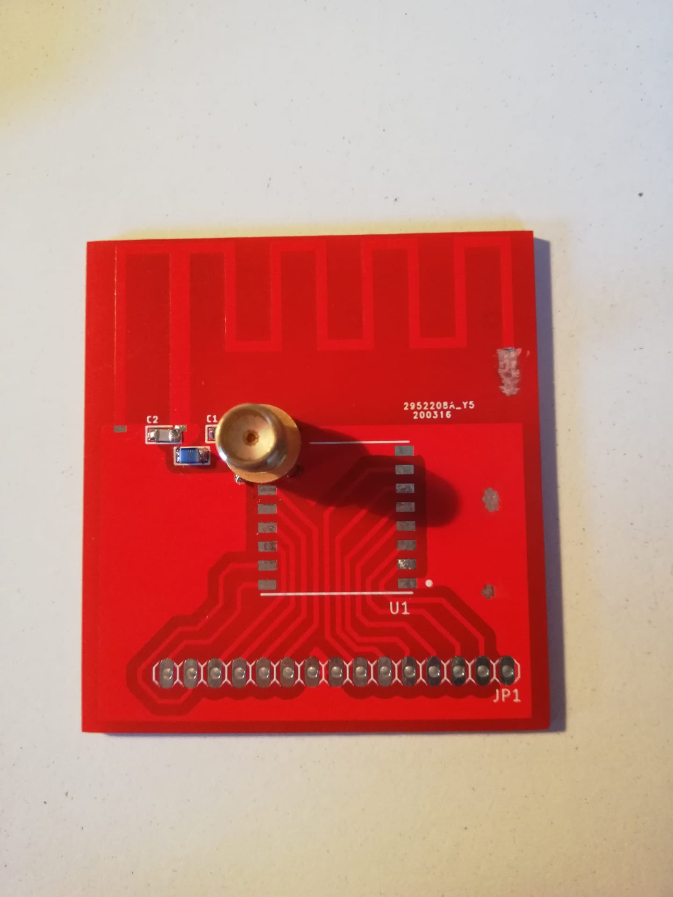

# TESTING

## test 1
Op C1 en C2 condensators van 2,2pF gesoldeerd. Voor de spoel een waarde van 12nH genomen.
Op de figuur hieronder kan je zien dat bij 868MHz er een VSWR van 1.88 is. Dit is al niet slecht. Dit wil zeggen dat 9% van het vermogen die naar de antenne gestuurd wordt terugkeert.

Het laagste punt van de VSWR zit op 831MHz en bedraagd hier dan 1.273.
Om dit laagste punt te verleggen naar 868MHz moet de antenne verkorten.

## test 2

Hierbij werd er 1mm van de laatste stukje van de antenne weggekrast
Het laagste punt zit nu op 840MHz.

## test 3
Hierbij werd er nog eens 1 mm weg gedaan (in totaat dus 2 mm).
Het laagste punt zit nu op 852MHz.

## test 4
nog eens 1 mm weggenomen. Het laagste punt zit nog steeds op 852MHz.

## test 5
nog eens 1 mm weggenomen. Het laagste punt zit nu op 864MHz.

## test 6
hier werd er weggekrast totdat het minimum op 868MHz lag. Op de figuur hieronder kan je waarnemen dat bij 868MHz de VSWR 1.112 bedraagd. Dit is 0.28% reflectie van je vermogen is die naar je antenne gestuurd word.

De totale lengte van het laatste stukje van de antenne bedraagd 1,25cm. (gemeten van de buitenste hoek)
Hieronder kan je het resultaat zien.

