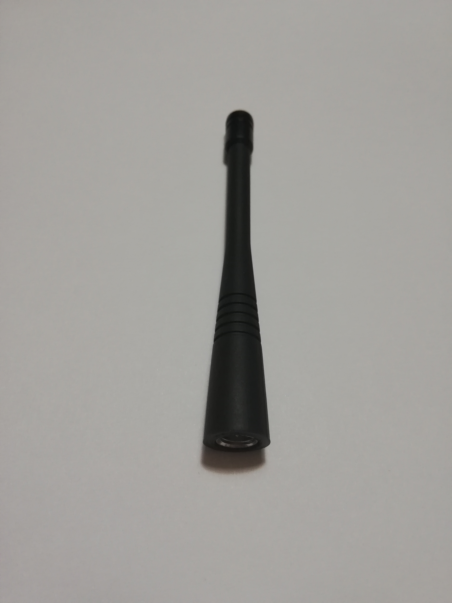
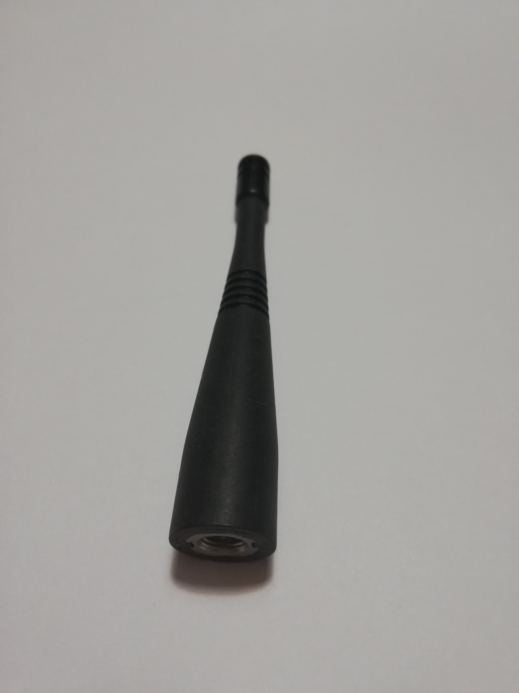

# The LoRaWAN-antenna board

Below you see the antenna board. The PCB antenna on this is suitable for a frequency around 868MHz.

Due the mismatches in impedance, some of the signal is reflected. You can solve this by doing 2 things.
Adjust the length of the antenna and add a matching network.

## adjust length

You can adjust the length here, by scratching away some copper at the end of the antenna. The total length of the last piece of the antenna is 1,25 cm. (measured from the outer corner) See the image below for clarification.

## matching network

You can observe the maching network below. This consists of 2 capacitors and 1 coil. The values of the capacitors are 2,2pF. The value of the coil is 12nF.

The network for adjusting the impedance is a PI network. The left side of the math unit is connected to the antenna output of the RF95 (pin 9). The right side of the unit is connected to the antenna.

The dimensions of the PCB are also very important. If the dimensions are different from here, you must again determine the length and the matching network.

Below you can see that the VSWR at 868MHz is 1.112.

## RF95

De antenne die gebruikt moet worden:

Als er antennes te kort zijn, dan is dit de 2de beste antenne:
