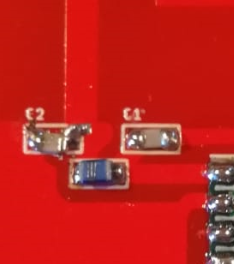

# The LoRaWAN-antenna board

This is the explanation of how the antenna PCB board came. And how you can make one yourself.
This PCB described here must then be connected to the main PCB. Below you can see what it looks like.

This Antenna on the board is based on [this](http://www.ti.com/lit/an/swra228c/swra228c.pdf) design.

## Explanation of the Antenna PCB board

Below you see the antenna board. The PCB antenna on this board is suitable for a frequency around 868MHz.

Due the mismatches in impedance, some of the signal is reflected. Because of the reflection you have a power loss and you could damage the RF95 module.
You can solve this by doing 2 things:

* Adjust the length of the antenna and,
* add a matching network.

This is discussed below here.

### Adjust length

You can adjust the length here, by scratching away some copper at the end of the antenna. The total length of the last piece of the antenna is 1,25 cm (measured from the outer corner). See the image below for clarification.

By adjusting the length of the antenna, the antenna is now al more suitable for 868MHz.

### Matching network

By adding a matching network now, we can improve the impedance of the antenna more.

The network for adjusting the impedance is a PI network. Below you can see the schematic of the network. The left side of the math unit is connected to the RF95 (the antenna output = pin 9). The right side of the unit is connected to the antenna.

You can observe the matching network below. This consists of 2 capacitors and 1 coil. The values of the capacitors are 2,2pF. The value of the coil is 12nF.

Due to mismatches in impedance, some of the signal is reflected. The ratio of the input to the reflected signal is called the Voltage Standing Wave Ratio (VSWR). This ratio can also be measured in dB, and expressed as Return Loss.

Below you can see that the VSWR at 868MHz is 1.112. This mean that you're return lose is 25.510dB. This is very good, because now less than 1% of the power goes back to the module. This means that more than 99% of the power is used for the communication.

The dimensions of the PCB are also very important. If the dimensions are different from here, you must again determine the length and the matching network.

### RF95

The RF95 module is a module suitable for ultra-long range spread spectrum communications. This module has a 20 dBm power amplifier. This means that you have an output power of 100mW. Because the impedance is now correct, all power will also be radiated effectively.

Below you see the RF95 module. All pins are brought out through the pins. Except the pin that goes to the antenna.
This PCB is then clicked on the main PCB.

### schematic and print in Eagle

Here you can see the schematic drawn in Eagle. At the top you see the pins, these are then connected to the main PCB. below that you see the RF95 chip.
In the middle you see the matching network, which ensures a correct impedance.
The square block on the right is the symbol for your antenna. It is a symbol whose foodprint is the shape of the antenna.

Below you can see what the PCB looks like in eagle.

### tests that happened

You can view the tests that happened in the folder "testing".

## Make it yourself

### Develop the PCB

First you need to develop the PCB. You can do this by sending a zip to a manufacturer. Like for example with this manufacturer([JLCPCB](https://jlcpcb.com/)).
The ZIP file is located here in the root and is called 'LoRaWAN_antenna.zip'. You can download and upload this on the manufacturer's website. If you want to make changes to the PCB you can edit it in the folder 'PCB-antenna-eagle'.

### Order the components

Then you have to order the components. These are the components:

* [coil (12nF)](https://be.farnell.com/te-connectivity/36502a12njtdg/inductor-12n-5-0805-case/dp/1265504?st=)
* [capacitors (2.2pF)](https://be.farnell.com/vishay/vj0805a2r2bxapw1bc/cap-2-2pf-50v-c0g-np0-0805/dp/2896503?st=)
* [RF95 module](https://www.antratek.be/rfm95-lora-module)
* [male pins](https://be.farnell.com/harwin/m20-9990846/connector-header-tht-2-54mm-8way/dp/1022257)

for 1 PCB you need 2 capacitors, 1 coil, 1 RF95 module and 15 male pins.

### Solder everything together

If you then have your PCB and components, you can start soldering.
You should not scratch the antenna anymore, I have already adjusted this in the last version.
For soldering it is best to start with the RF95 module and then the capacitors and the coil.
Then solder the pins on the last.
