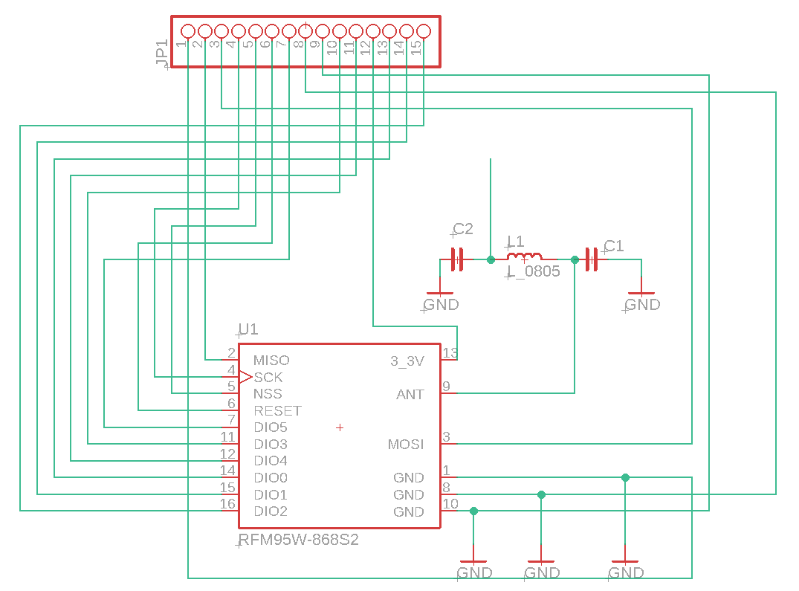

# Design about the PCB antenna
## pi-network
Pi-network bestaat uit C3, C4 en L1. (footprint 0805), waarden zullen moeten gemeten worden als de antenna ontworpen is. Dit om ervoor te zorgen dat je een juiste impedantie aanpassing van 50 ohm hebt.

## Eagle schema

## Eagle print

## printen op mika
De transparant maken in mislukt. Er werden verschillende instellingen bij de printer geprobeerd.

Er zal dus een print besteld worden, in plaats van zelf te etsen.

