# TESTING

## test 1

Op C1 en C2 condensators van 2,2pF gesoldeerd. Voor de spoel een waarde van 12nH genomen.
Op de figuur hieronder kan je zien dat bij 868MHz er een VSWR van 1.88 is. Dit is al niet slecht. Dit wil zeggen dat 9% van het vermogen die naar de antenne gestuurd wordt terugkeert.

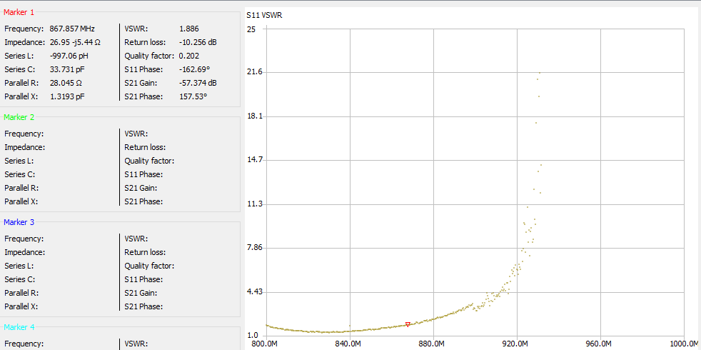

Het laagste punt van de VSWR zit op 831MHz en bedraagd hier dan 1.273.
Om dit laagste punt te verleggen naar 868MHz moet de antenne verkorten.

## test 2

Hierbij werd er 1mm van de laatste stukje van de antenne weggekrast
Het laagste punt zit nu op 840MHz.

## test 3

Hierbij werd er nog eens 1 mm weg gedaan (in totaat dus 2 mm).
Het laagste punt zit nu op 852MHz.

## test 4

nog eens 1 mm weggenomen. Het laagste punt zit nog steeds op 852MHz.

## test 5

nog eens 1 mm weggenomen. Het laagste punt zit nu op 864MHz.

## test 6

hier werd er weggekrast totdat het minimum op 868MHz lag. Op de figuur hieronder kan je waarnemen dat bij 868MHz de VSWR 1.112 bedraagd. Dit is 0.28% reflectie van je vermogen is die naar je antenne gestuurd word.

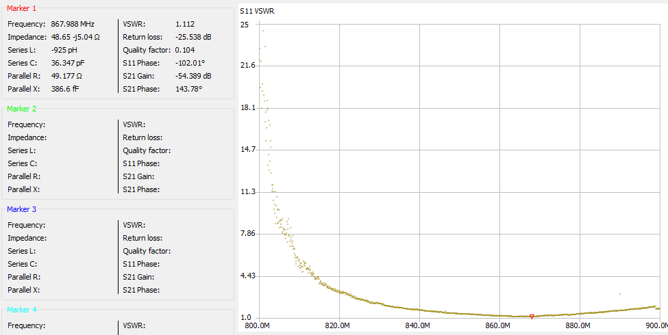

De totale lengte van het laatste stukje van de antenne bedraagd 1,25cm. (gemeten van de buitenste hoek)
Hieronder kan je het resultaat zien.

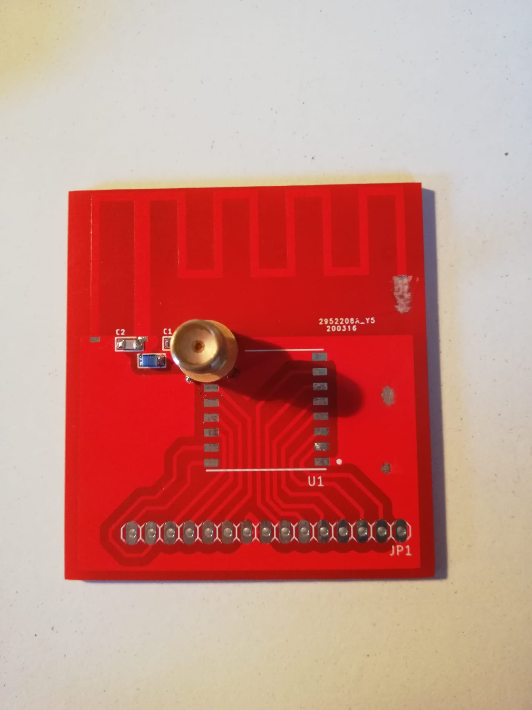

# making board with lora module

the antenna scratched to the correct length and soldered the components on it.
the pins are properly soldered so that they can be connected to Niels' board.
this is the frond:

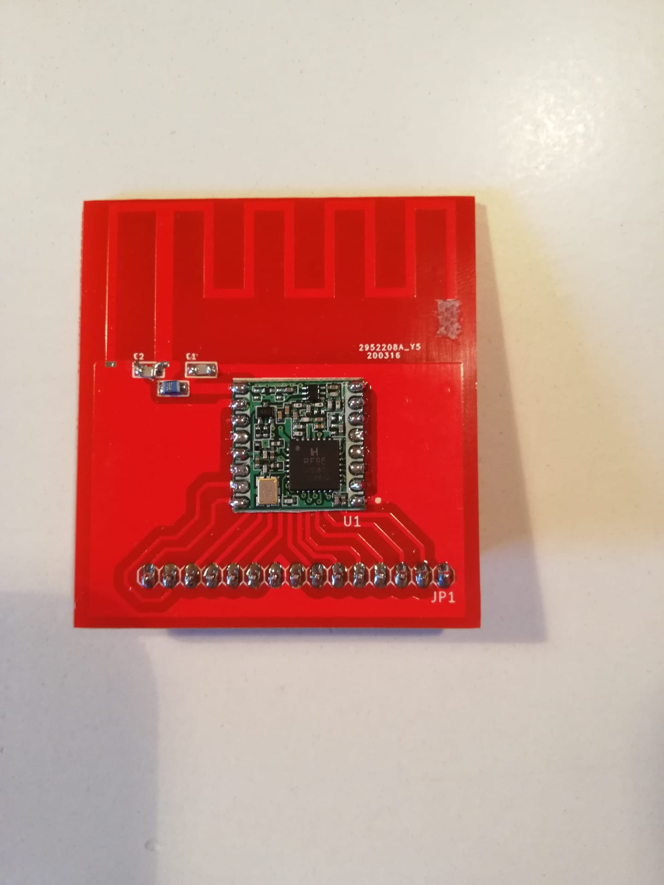

and this is the back:

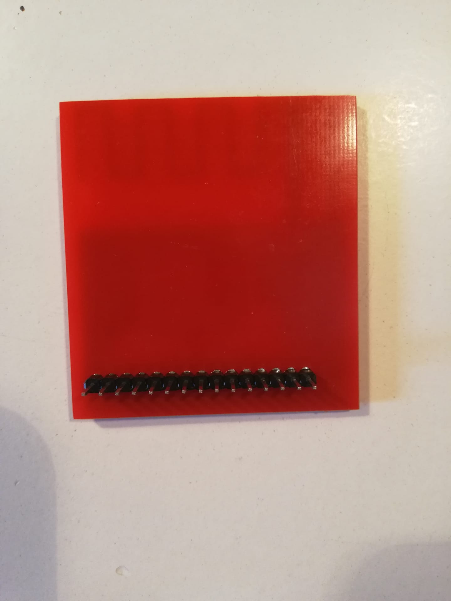

## testing the board with an arduino

Found this on the internet: https://www.mobilefish.com/developer/lorawan/lorawan_quickguide_build_lora_node_rfm95_arduino_uno.html

the connection between the arduino and the RF95 module:

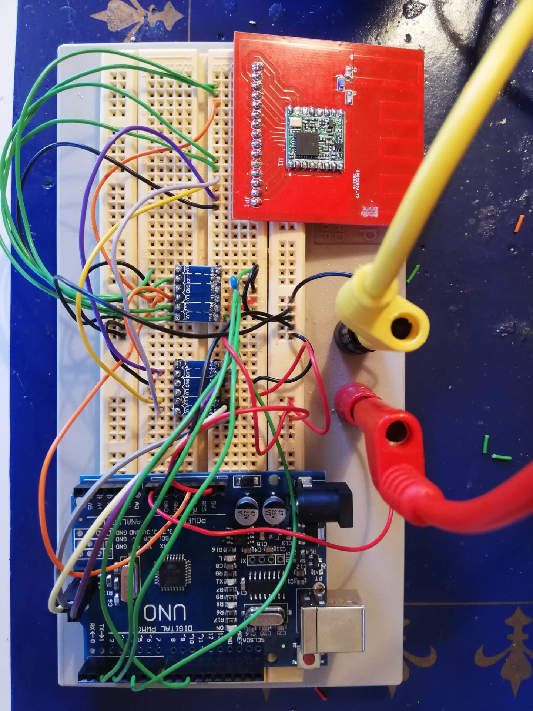

Between the arduino en de RF95 module, are there level converters. This is to convert de voltage from 5V to 3,3V.

The program loaded into the arduino. But there were a lot of errors. Unfortunately, the errors cannot be resolved.

Searched another example on the internet:

https://www.disk91.com/2019/technology/lora/hoperf-rfm95-and-arduino-a-low-cost-lorawan-solution/

Here I got no more errors. But on the console of the TTN I saw no connectivity.

there is no further testing on this because I now got a board from Niels.

## testing the board with the board of Niels

the PCB board connected to the board of niels. Then loaded the software into the nucleo. The software comes from here:
https://github.com/vives-projectwerk-2-2020/LoRaWAN-example

In the setting.h something has to be changed about the pins. This is how it should look for the little nucleo:

Added a device on TTN and put the keys in a file settings.h as described in the LoRaWan-example.

Here you can see the communication over the port with Putty:

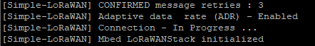

below you can see that there is a connection with TTN:

below the 2 connected to each other:

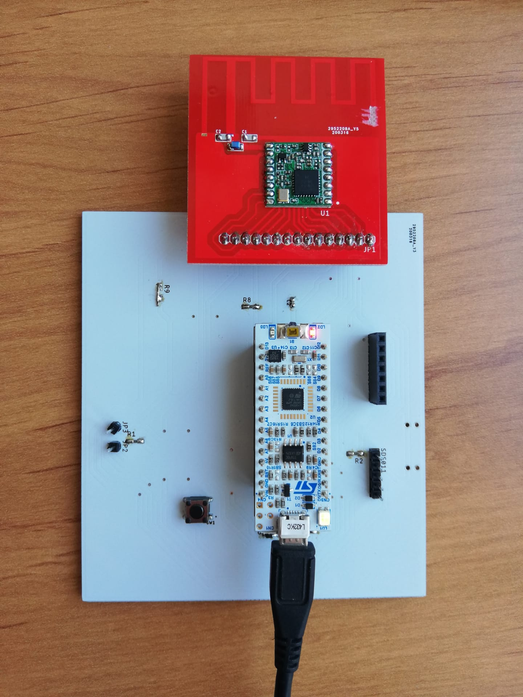

## test the range

The points below you can see where I managed to connect to my gateway:

punt1: 1,1km, the antennas see each other here

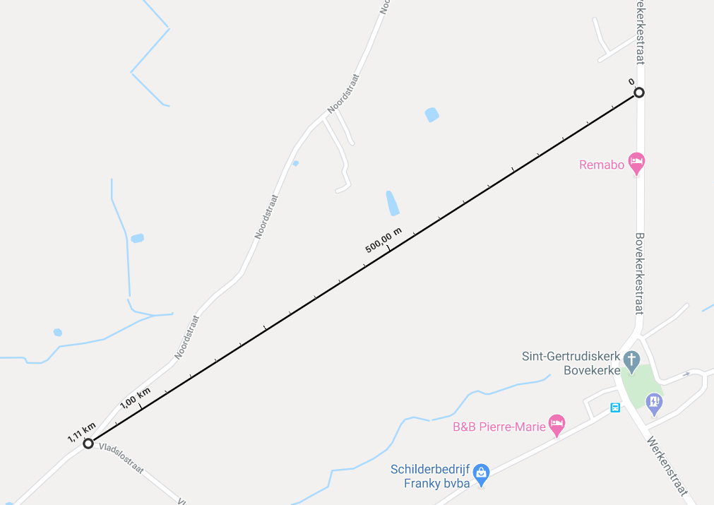

punt2: 1,76km, the antennas did not see each other, there was a large concrete storage place in front of it.

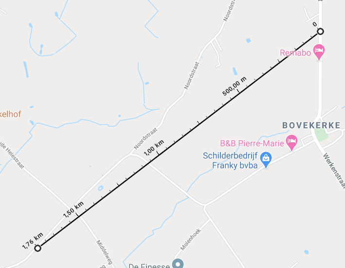

## test the range with a better antenna on the gateway

The antenna is now 10m high. The test setup can be found in the following 2 images.
In the box is the gateway (LG02 from dragino). 1 of the original antennas is disconnected and connected to the large antenna. This is an antenna with 3dB gain.
The antenna is mounted via a bracket on the pole. The bracket is self-made.

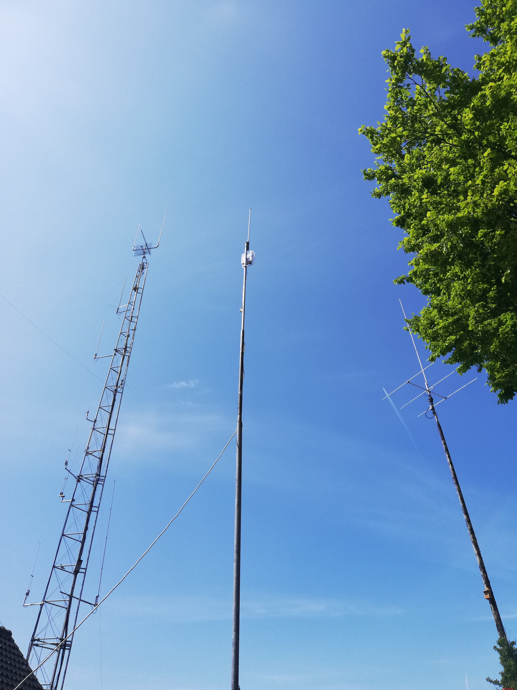
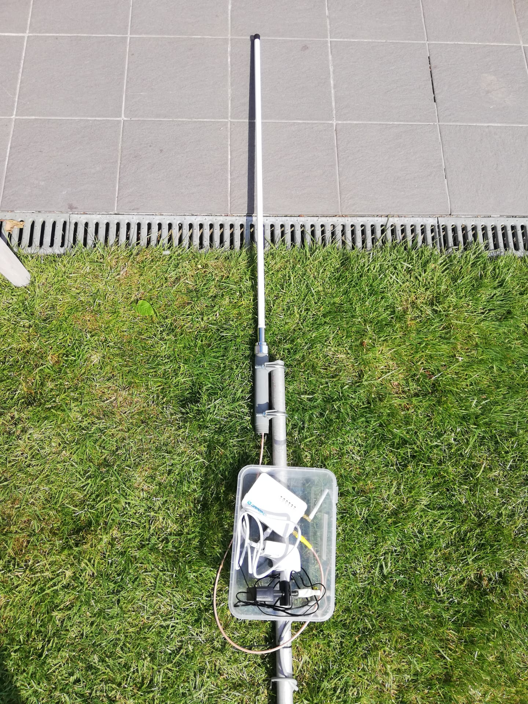

The range is now much better, it is doubled. distances of 3.20 km are now possible, you can see this on the map below.
the points below are points where connections to TTN could be made. At the points you can always see the distance in bird's eye view.

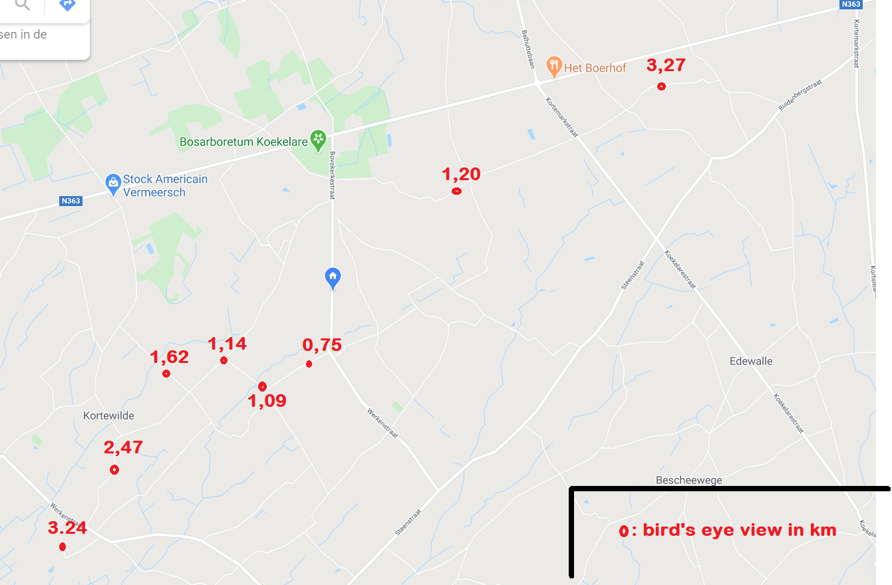

## test the different between the PCB antenna and the previous antenna

Below you see the circuit:

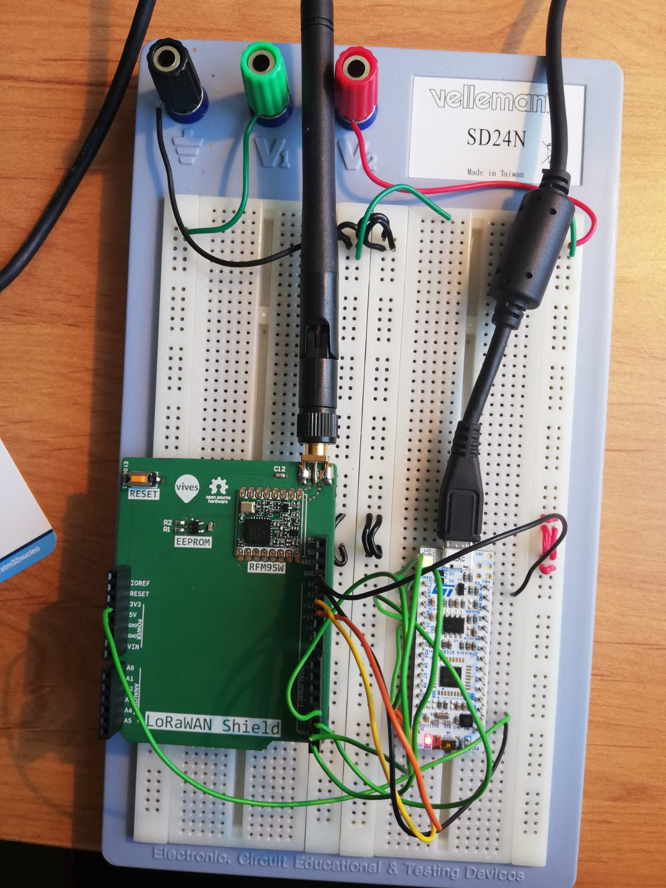

Here you can see where there was signal with TTN. You can see that the range with that previous antenna is much smaller.
This means that the PCB antenna is an improvement on the previous antenna.

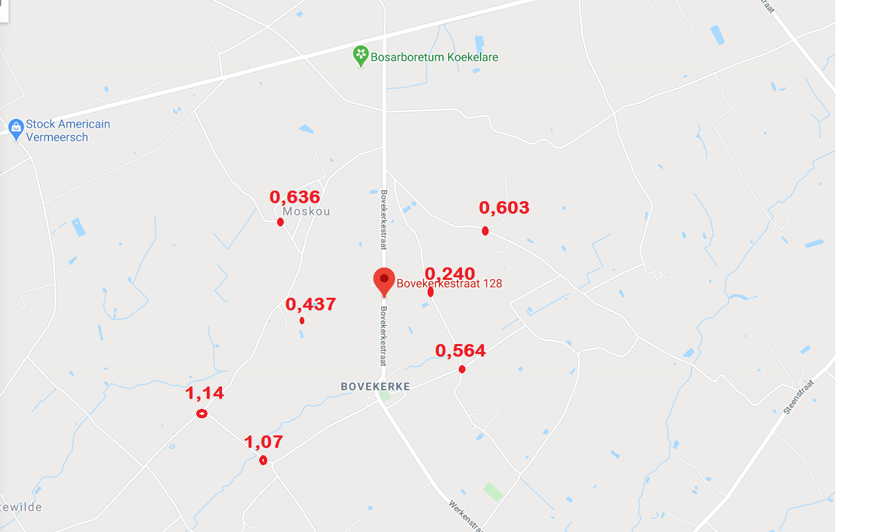
